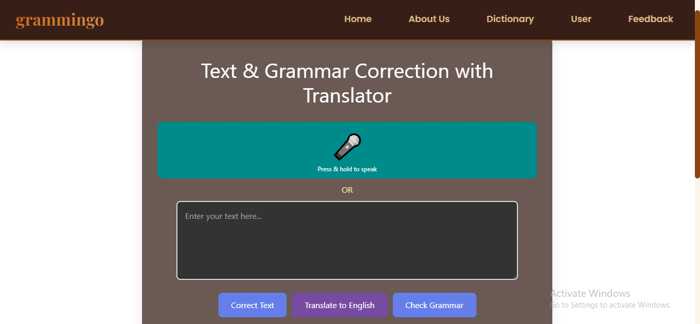
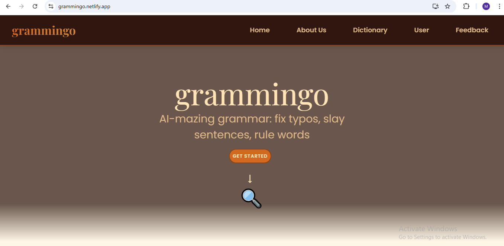
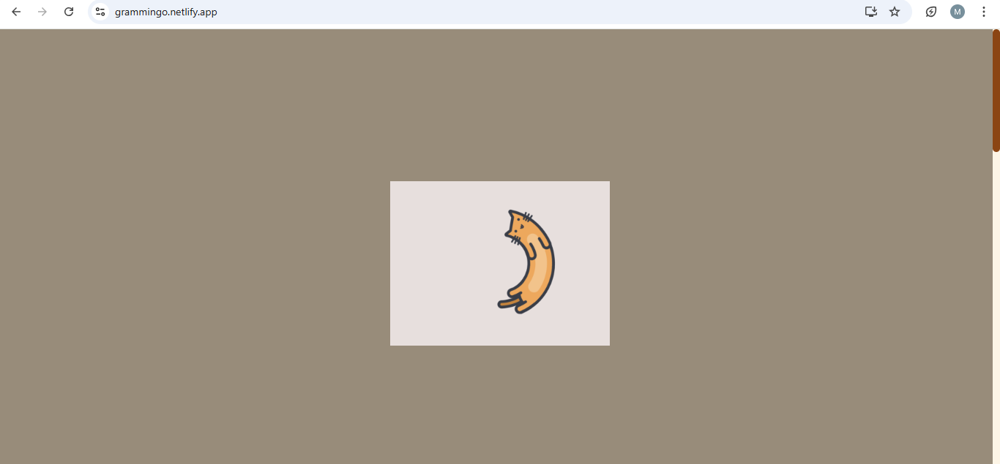
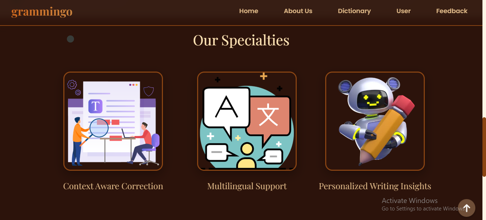

# gramminGo

With this passion for language, we are excited to introduce grammingo:an interactive, game-based learning app designed to improve spelling, grammar, and word usage in English & Hindi. Through AI-driven challenges, voice interactions, and real life scenarios, It makes learning languages fun, immersive, and effective.

## Table of Contents
- [Tech Stack](#tech-stack)
- [Installation](#installation)
- [Usage](#usage)
- [Contributing](#contributing)
- [License](#license)

## Key Features:

Al Role Playing Conversations - Users engage in spoken or text based conversations with

virtual characters (teacher, boss, customer, Al coach, etc.), where Al corrects grammar in real time and explains mistakes in a fun, engaging way

Grammar Battle Mode - Players challenge Al or friends in real time spelling & grammar correction battles, racing to fix sentences and earn points, badges, and fun Al generated rewards.

Scan & Fix - Users scan signboards, menus, posters, or handwritten notes, and Al detects and corrects errors instantly.

Auto Translate & Hinglish Fixer - Converts Hinglish into proper English or Hindi for

seamless bilingual learning.

Example: "Mujhe ek coffee pls" -> "मुझे एक कॉफी चाहिए" OR "I would like a coffee, please."

Sing & Correct Mode - Users sing or rap lyrics with grammar mistakes, and Al corrects and enhances them while suggesting rhymes & synonyms for songwriting.

## Tech Stack
- **Frontend:** React.js, tailwind CSS
- **State Management:** fastAPI
- **Backend:** Node.js, Express (planned for future)
- **Database:** PostgreSQL

## Screenshots:







## Installation

### Prerequisites
Before you begin, ensure you have installed the following:
- [Node.js](https://nodejs.org/) (v14.x or higher)
- [npm](https://www.npmjs.com/) (v6.x or higher)

### Setup
Follow the steps below to set up the project locally:

```bash
# Clone the repository

git clone https://github.com/vimistify/gramminGo.git

# Navigate into the project directory
cd gramminGo
 # Install the required npm packages
npm install

git clone https://github.com/vimistify/gramminGo.git
```
```bash
# Navigate into the project directory
cd gramminGo
```
```bash
# Install the required npm packages
npm install (or) npm i
```
```bash

# Start the React development server
npm start
```

</div>

## Contributors 

 [Contributing Guidelines](./CONTRIBUTING.md)

 [](https://github.com/vimistify/gramminGo/graphs/contributors)

## Code of Conduct 
Please follow our [Code of Conduct](./CODE_OF_CONDUCT.md) to ensure a welcoming environment for everyone.  

## License 
This project is licensed under the [MIT License](./LICENSE).  


